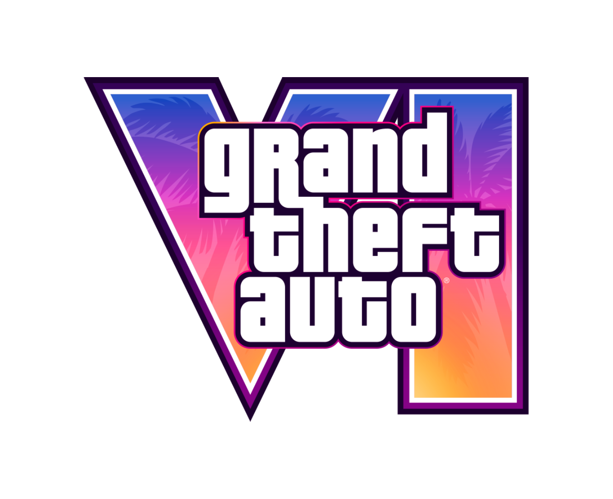

# 🌴 GTA VI - Licznik Do Premiery / Fan Release Countdown

<p align="center">
  
</p>

---

### 🌐 Wybierz język / Choose language:
* [Po polsku 🇵🇱](#pl)
* [In English 🇬🇧](#en)

---
<a id="pl"></a>
## 🇵🇱 GTA VI - Licznik Do Premiery (PL)

Siemanko! Jest to prosty, klimatyczny i w 100% **fanowski projekt** strony internetowej, która odlicza czas do wyczekiwanej premiery **Grand Theft Auto VI** (zaplanowanej na 19 listopada 2026 roku). 

Strona została stworzona z zajawki do serii – ma cieszyć oko dynamicznym tłem z grafikami z gry, puszczać oficjalne trailery i automatycznie zmienić się w stronę "Kup Teraz" (z linkami do preorderów), kiedy licznik w końcu dobije do zera!

### 🚀 Co ta strona potrafi?
* **Licznik na żywo (PL / EN):** Odlicza dni, godziny, minuty i sekundy. Możesz przełączać język w prawym górnym rogu (strona zapamiętuje Twój wybór!).
* **Klimatyczne tło:** Fotki w tle automatycznie się zmieniają, pokazując lokacje i postacie z Vice City.
* **Wyskakujące Trailery:** Klikasz w kartę zwiastuna i oglądasz oficjalne materiały z YouTube w ładnym, wyskakującym okienku (modal), bez wychodzenia ze strony.
* **Tryb Premiery (Preordery):** Skrypt pilnuje daty. Gdy nadejdzie 19.11.2026, licznik zniknie, a na stronie pojawi się sekcja zachęcająca do zakupu gierki.
* **Responsywność:** Wszystko działa i wygląda dobrze zarówno na monitorze, jak i na ekranie telefonu.

### 📂 Jak to jest poukładane? (Pliki)
Żeby wszystko działało jak trzeba, wrzuć swoje pliki, zdjęcia i logo w takiej strukturze:
```text
├── index.html                  # Kod i struktura strony
├── style.css                   # Wygląd, kolory i efekty blur w tle
├── script.js                   # Logika licznika, zmiana języka i obsługa wideo
├── gta_vi_icon.ico             # Ikona strony na karcie w przeglądarce
└── images/                     # Folder na wszystkie grafiki
    ├── gta_vi_logo.webp        # Główne logo gry
    ├── Artwork/                # Oficjalne arty (np. Jason i Lucia)
    ├── People/                 # Grafiki postaci z gry
    └── Places/                 # Widoki z Vice City / Port Gellhorn
```
### ⚠️ WAŻNE
Nieoficjalny projekt fanowski · Nie jest powiązany z Rockstar Games ani Take-Two Interactive

---
<a id="en"></a>
## 🇬🇧 GTA VI - Release Countdown (EN)

Hey there! This is a simple, atmospheric, and 100% **fan-made project** for a website counting down the time until the highly anticipated release of **Grand Theft Auto VI** (scheduled for November 19, 2026). 

This page was built out of pure hype for the franchise! It features a dynamic background slideshow with game graphics, lets you watch official trailers, and will automatically transform into a "Buy Now" page (with preorder vibes) once the countdown hits zero!

### 🚀 Key Features?
* **Live Countdown (PL / EN):** Ticks down days, hours, minutes, and seconds. You can switch the language in the top-right corner, and the site will remember your preference!
* **Atmospheric Backgrounds:** The background images automatically cycle through, showcasing various characters and locations from Vice City.
* **Trailer Popups:** Click on any trailer card to watch official YouTube videos in a sleek popup window (modal) without leaving the site.
* **Release Mode (Preorders ready):** The script keeps track of the date. On November 19, 2026, the countdown will disappear and change into a "Buy Now" section.
* **Fully Responsive:** Everything runs smoothly and looks great on both desktop monitors and mobile screens.

### 📂 Repository Structure
To keep the scripts working correctly, make sure to organize your files and folders like this:
```text
├── index.html                  # Main page structure
├── style.css                   # Colors, layouts, and background blur effects
├── script.js                   # Countdown logic, i18n language toggle, and video modal
├── gta_vi_icon.ico             # Website favicon
└── images/                     # Asset folder for all graphics
    ├── gta_vi_logo.webp        # Main game logo
    ├── Artwork/                # Official art pieces (e.g., Jason & Lucia)
    ├── People/                 # Character graphics in subfolders
    └── Places/                 # In-game landscapes (e.g., Vice City, Port Gellhorn)
```
### ⚠️ IMPORTANT
Unofficial fan project · Not affiliated with Rockstar Games or Take-Two Interactive
